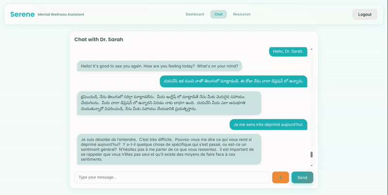
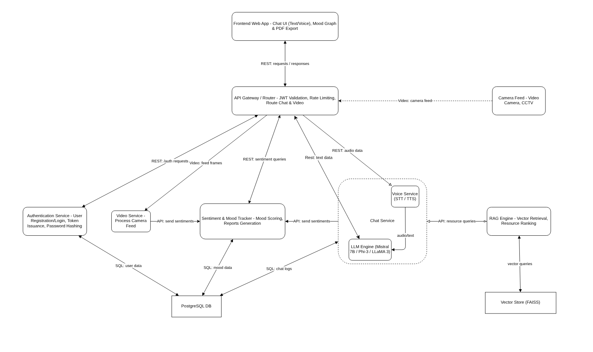

# 🌸 Serene - AI Mental Health Support Platform

## 📝 Problem Statement

Postpartum depression (PPD) affects approximately 1 in 7 mothers, making it one of the most common complications of childbirth. Despite its prevalence, PPD remains severely underdiagnosed and undertreated, with only about 15% of affected women receiving appropriate care. The condition can have devastating consequences, including impaired mother-infant bonding, developmental delays in children, and in severe cases, thoughts of self-harm or harm to the baby. Traditional barriers to treatment include stigma, lack of screening, limited access to mental health professionals, and the logistical challenges of attending in-person therapy with a newborn. The critical postpartum period requires accessible, immediate, and personalized mental health support that can adapt to the unique needs of new mothers.

## 💡 Solution



Serene is a comprehensive AI-powered mental health platform designed to provide immediate, accessible support for individuals experiencing postpartum depression and other mental health challenges. By combining advanced conversational AI with voice recognition, sentiment analysis, and video emotion detection, Serene creates a seamless therapeutic experience that can be accessed anytime, anywhere. The platform offers personalized interventions, tracks emotional wellbeing over time, and connects users with appropriate resources while maintaining privacy and security.

## 🏗️ Architecture



### Service Endpoints
- **Frontend**: http://localhost:3000
- **API Gateway**: http://localhost:8080
- **Authentication**: http://localhost:8000
- **Chatbot Service**: http://localhost:8001
- **Sentiment Analytics**: http://localhost:8002
- **Voice Processing**: http://localhost:8003
- **Video Processing**: http://localhost:8004
- **RAG System**: http://localhost:8005
- **Database**: localhost:5432

## 🚀 Quick Start Guide

### Prerequisites
- Docker & Docker Compose
- 8GB RAM (recommended)
- 10GB free disk space

### API Keys Setup

Serene currently uses Google's Gemini 1.5 Flash model, but you can substitute your own open source model in the chatbot service.

1. **Google Gemini API Key**:
   - Get your API key from [Google AI Studio](https://makersuite.google.com/app/apikey)
   
2. **Google Search API Key & Search Engine ID**:
   - Create a [Programmable Search Engine](https://programmablesearchengine.google.com/controlpanel/create)
   - Get your API key from [Google Developer Console](https://developers.google.com/custom-search/v1/overview#api_key)

### Configuration

Update your API keys in the `docker-compose.yml` file:

```yaml
chatbot_service:
  environment:
    - GOOGLE_API_KEY=your_gemini_api_key_here
    - GOOGLE_SEARCH_API_KEY=your_search_api_key_here
    - GOOGLE_SEARCH_ENGINE_ID=your_search_engine_id_here
```

Launch the Application
```bash
# Build and start all services
docker compose up --build -d

# Access the application
open http://localhost:3000
```

## 🧩 Microservices Ecosystem

### API Gateway (`/api_gateway`)
- **Core Functionality**: Central orchestration layer that routes requests to appropriate services
- **Implementation**: FastAPI-based service with route handlers for each microservice
- **Description**: Serves as the single entry point for all client requests, routing them to the appropriate microservices while handling cross-cutting concerns like authentication and request logging.

### Auth Service (`/auth_service`)
- **Core Functionality**: User authentication and account management
- **Features**:
  - JWT token authentication
  - User registration and profile management
  - Secure password handling
  - Token refresh mechanism
- **API Endpoints**:
  - `/auth/register`: User registration
  - `/auth/login`: Authentication
  - `/auth/refresh`: Token renewal
  - `/auth/logout`: Session termination
- **Description**: Handles all aspects of user identity and access control, ensuring secure interactions throughout the platform.

### Chatbot Service (`/chatbot_service`)
- **Core Functionality**: Therapeutic conversational AI using Google Gemini
- **Features**:
  - Natural language understanding and generation
  - Context-aware responses
  - Web search integration for resource discovery
  - Conversation memory and context management
- **Description**: Provides empathetic, context-aware responses to user messages, integrating external knowledge when appropriate to offer helpful resources.

### Sentiment Service (`/sentiment_service`)
- **Core Functionality**: Emotional analysis and wellness tracking
- **Features**:
  - 15-parameter emotional analysis
  - Progress tracking over time
  - Report generation
  - Data aggregation for insights
- **Implementation**:
  - Python-based analysis engine
  - Statistical models for trend identification
  - REST API for data retrieval
- **Description**: Analyzes user messages to identify emotional patterns, providing insights that help users understand their mental health journey.

### Voice Service (`/voice_service`)
- **Core Functionality**: Speech-to-text and audio processing
- **Features**:
  - Voice message transcription
  - Multilingual support
  - Integration with chatbot service
- **Key Components**:
  - OpenAI Whisper model for transcription
  - Audio preprocessing utilities
  - Speech analysis pipeline
- **Description**: Allows users to communicate through voice messages, which are transcribed and analyzed for both content and emotional indicators.

### Video Service (`/video_service`)
- **Core Functionality**: Video and image processing for emotion detection
- **Features**:
  - Facial emotion analysis using deepface
  - Video frame processing
  - Non-verbal emotional intelligence
- **Implementation**:
  - Deep learning models for facial analysis
  - Frame extraction and processing pipeline
  - Emotion classification and aggregation


- **Description**: Analyzes facial expressions in video to identify emotions that might not be expressed verbally, providing a more complete picture of the user's emotional state.

### RAG System (`/rag_system`)
- **Core Functionality**: Retrieval-Augmented Generation for contextual responses
- **Features**:
  - Mental health knowledge base
  - Contextual information retrieval
  - Query-relevant resource recommendations
- **Description**: Enhances the chatbot's responses by retrieving relevant mental health information from a specialized knowledge base, ensuring accurate and helpful information.

### PostgreSQL Database (`/database`)
- **Core Functionality**: Persistent data storage for all services
- **Features**:
  - User data storage
  - Conversation history
  - Sentiment analytics
  - System configuration
- **Description**: Provides reliable, structured storage for all application data, with appropriate relationships between entities to support complex queries and analytics.

### Frontend (`/frontend`)
- **Core Functionality**: User interface for the Serene platform
- **Features**:
  - Responsive React-based UI
  - Real-time chat interface
  - Wellness report visualization
  - Resource library
- **Key Components**:
  - React components for different features
  - State management
  - API service integration
  - Styling and theming
- **Description**: Delivers an intuitive, accessible interface that makes mental health support approachable and effective for all users.

Built with ❤️ for Mental Health by Aman, Hemant and Piyush